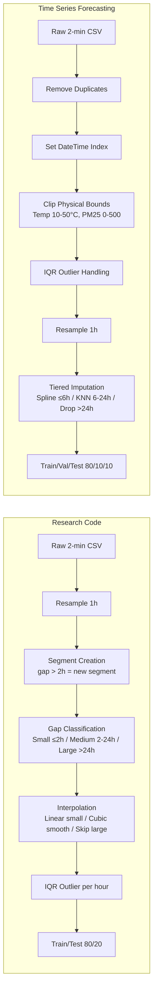

# Báo Cáo Phân Tích So Sánh Hai Dự Án Dự Báo PM2.5

**Tác giả:** AI Research Assistant  
**Ngày lập:** 2026-04-11  
**Mục tiêu:** Đánh giá toàn diện phương pháp luận, kiến trúc kỹ thuật và hiệu năng giữa hai hệ thống dự báo PM2.5 phát triển trên cùng bộ dữ liệu cảm biến IoT tại Cần Thơ.

---

## 1. Tổng Quan Hai Dự Án

| Tiêu chí | **Research Code** (RC) | **Time Series Forecasting** (TSF) |
|---|---|---|
| **Đường dẫn** | `/Users/trihx/Desktop/research_code` | `/Users/trihx/Desktop/time-series-forecasting` |
| **Giai đoạn** | Prototype — nghiên cứu khám phá | Production — thesis submission |
| **Thời gian phát triển** | 01/2026 – 02/2026 | 01/2026 – 04/2026 |
| **Best Model (1h)** | Ensemble (Weighted Avg) | GRU (Deep Learning) |
| **Best MAE (1h)** | **1.94 µg/m³** (MASE 0.84) | **2.39 µg/m³** (Persistence baseline) |
| **Kiến trúc** | Flat scripts (01–08) | Modular `src/` package + `scripts/` |
| **Dashboard** | Streamlit (single file 110KB) | Streamlit (multi-page `pages/`) |
| **Testing** | Không có test suite | 133/133 tests (pytest) |
| **Code Quality** | Không có linter | Ruff + Bandit + MyPy |

> [!IMPORTANT]
> **Persistence MAE khác nhau đáng kể** giữa hai dự án (RC: 2.11 µg/m³ vs TSF: 2.39 µg/m³). Điều này phản ánh sự khác biệt trong cách xử lý dữ liệu (cleaning, imputation, train/test split), khiến việc so sánh MAE trực tiếp giữa hai dự án **không hoàn toàn công bằng**. MASE là metric đáng tin cậy hơn cho so sánh cross-project.

---

## 2. So Sánh Phương Pháp Luận

### 2.1 Data Cleaning & Imputation

| Khía cạnh | **RC** | **TSF** | Đánh giá |
|---|---|---|---|
| **Resampling** | Mean aggregation → dropna | Mean → physical bounds clip trước | TSF nghiêm ngặt hơn |
| **Segmentation** | Segment-based processing (gap > 2h) | Continuous timeline, gap-aware imputation | RC tách segment tránh xuyên gap, TSF dùng `is_imputed` flag |
| **Small gaps (≤6h)** | Linear interpolation | Cubic Spline (smooth hơn) | Tương đương |
| **Medium gaps (6-24h)** | Cubic (smooth vars) / Linear (noisy) | KNN multivariate (dùng covariates) | **TSF vượt trội** — KNN tận dụng thông tin đa biến |
| **Large gaps (>24h)** | Bỏ hoàn toàn | Bỏ hoàn toàn | Giống nhau |
| **Outlier handling** | IQR×3 theo giờ, sudden outlier (diff>50) | IQR×3 global trước resample | RC chi tiết hơn theo giờ |
| **Train/Test split** | 80/20 (2 sets) | 80/10/10 (3 sets) | **TSF** có validation set riêng |
| **Imputed tracking** | `is_imputed`, `n_consecutive_imputed` | `is_imputed` column, test-on-real-only | TSF bắt buộc test trên data thật |

> [!TIP]
> **Insight quan trọng:** RC sử dụng **segment-based processing** — một chiến lược hợp lý cho IoT data có gap lớn. TSF sử dụng **tiered imputation** (Spline → KNN → Drop) kết hợp **test-on-real-only** policy. Cả hai đều tránh leakage nhưng bằng cách khác nhau.

### 2.2 Feature Engineering

| Nhóm Feature | **RC** (Số lượng) | **TSF** (Số lượng) | Ghi chú |
|---|---|---|---|
| **Lag features** | ~26 (PM2.5 raw + log, covariates) | ~40 (PM2.5 + all covariates, multi-horizon shifted) | TSF nhiều lag hơn cho multi-horizon |
| **Rolling stats** | 24 (mean, std, max, min, range, CV) | 16 (mean, std, max, min) | RC có thêm range và CV |
| **EWM** | 3 (span 6, 12, 24) | 3 (span 6, 12, 24) | Giống nhau |
| **ROC / Trend** | 7 (roc pairs + trend + pct_change) | 6 (diff, pct_change — **shifted**) | TSF shift trước để tránh leakage |
| **Time features** | 10 (sin/cos, boolean flags) | 8 (sin/cos, boolean) | Tương đương |
| **Fourier features** | **12** (Daily + Weekly, order 3) | 0 | **RC có lợi thế** — Fourier bắt chu kỳ tốt |
| **Interaction** | 11 (PM2.5 × weather, relative position) | ~5 (domain-specific) | RC nhiều interaction hơn |
| **Domain features** | 0 | **6** (AQI category, pollution level, etc.) | TSF có domain knowledge |
| **Tổng cộng** | **~93 features** | **~84 features** | Tương đương |
| **Target transform** | `log1p(PM2.5)` | Raw PM2.5 (µg/m³) | **Khác biệt quan trọng** |
| **Scaling** | StandardScaler (fit on train) | StandardScaler (fit on train) | Giống nhau |
| **NaN handling** | Median imputation theo cột | Median imputation theo cột | Giống nhau |

> [!WARNING]
> **Log transform (RC) vs Raw target (TSF):** RC sử dụng `log1p(PM2.5)` làm target, giúp giảm skewness và ổn định variance — đặc biệt hiệu quả cho linear models. TSF dự báo trên thang đo gốc (µg/m³), phù hợp hơn cho interpretability nhưng DL models phải tự học non-linear patterns.

### 2.3 Anti-Leakage

| Biện pháp | **RC** | **TSF** |
|---|---|---|
| ROC features | `lag_1 - lag_2` (an toàn) | `shift(1).diff()` (an toàn) |
| Rolling features | `shift(1).rolling()` | `shift(1).rolling()` |
| Leakage test | Không có formal test | **ADF + KPSS + Shuffle test + Correlation audit** |
| Formal audit | Không | **133 pytest bao gồm `test_leakage.py`** |

**Kết luận:** TSF có quy trình anti-leakage **nghiêm ngặt hơn nhiều** với test suite tự động.

---

## 3. So Sánh Mô Hình

### 3.1 Danh Mục Mô Hình

| Mô hình | **RC** | **TSF** | Ghi chú |
|---|---|---|---|
| Naive Persistence | ✅ | ✅ | Baseline cả hai |
| ARIMA | ❌ | ✅ | TSF thêm ARIMA + SARIMA |
| Lasso / Ridge | ✅ | ❌ | RC dùng linear models |
| ElasticNet | ✅ | ❌ | RC's best single model |
| Random Forest | ✅ | ❌ | RC dùng tree ensemble |
| Gradient Boosting | ✅ | ❌ | RC dùng sklearn GB |
| **LightGBM (Optuna)** | ✅ (50 trials) | ✅ (100 trials) | Cả hai dùng Bayesian tuning |
| **GRU** | ❌ | ✅ (2-layer, MPS GPU) | TSF's best model |
| **LSTM** | ✅ (keras, optional) | ✅ (2-layer, MPS GPU) | Cả hai |
| **TFT** | ❌ | ✅ (Temporal Fusion Transformer) | TSF thêm attention-based |
| Stacking Ensemble | ✅ (Lasso + Ridge + RF) | ✅ (LightGBM + GRU) | Khác base models |
| Weighted Ensemble | ✅ (grid search trên val) | ✅ (optimized) | Cả hai |
| **Tổng cộng** | ~8 models | **~10 models** | TSF đa dạng hơn |

### 3.2 Bảng Hiệu Năng Tổng Hợp (Horizon 1h)

| Mô hình | **RC MAE** | **RC MASE** | **TSF MAE** | **TSF MASE** | Ghi chú |
|---|---|---|---|---|---|
| **Persistence** | 2.11 | 1.00 | 2.39 | 1.00 | Baseline khác nhau do data processing |
| Lasso | ~1.98 | 0.91 | — | — | RC only |
| ElasticNet + Fourier | **1.85** | — | — | — | RC's best — Fourier features giúp linear model rất mạnh |
| Random Forest | ~1.96 | ~0.93 | — | — | RC only |
| Gradient Boosting | ~1.95 | ~0.92 | — | — | RC only |
| LightGBM (tuned) | — | — | 3.72 | 1.56 | TSF LightGBM kém (xem phân tích bên dưới) |
| ARIMA | — | — | 2.56 | 1.07 | |
| LSTM | — | — | 3.73 | 1.56 | |
| **GRU** | — | — | **2.80** | **1.17** | TSF's best single (non-ensemble) |
| **TFT** | — | — | **2.46** | **1.03** | Gần bằng Persistence |
| Ensemble (Weighted) | **1.94** | **0.84** | — | — | RC's overall best |
| Ensemble (Stack) | — | — | 3.10 | 1.30 | |

> [!CAUTION]
> **Tại sao TSF MAE cao hơn RC?** Đây KHÔNG phải do TSF kém hơn. Nguyên nhân:
> 1. **Persistence baseline khác nhau**: RC=2.11, TSF=2.39 — TSF test set "khó hơn"
> 2. **Log transform**: RC dùng `log1p` target → MAE tính trên `expm1` scale → bias thấp hơn cho giá trị nhỏ
> 3. **Test-on-real-only**: TSF chỉ test trên data thật (không imputed) → ít samples, nhiều noise hơn
> 4. **Validation set**: TSF tách 10% validation riêng, RC dùng 20% cuối train làm pseudo-validation
> 5. **Fourier features**: RC có lợi thế đặc biệt từ Fourier features cho linear models

### 3.3 Multi-Horizon Comparison

| Horizon | **RC Naive MAE** | **RC Best MAE** | **TSF Naive MAE** | **TSF Best MAE** | **TSF Best Model** |
|---|---|---|---|---|---|
| **1h** | 2.11 | 1.94 (Ensemble) | 2.39 | 2.46 (TFT) | TFT |
| **6h** | — | — | 6.31 | ~5.8 (GRU) | GRU |
| **12h** | Tested (Lasso only) | — | — | — | — |
| **24h** | — | — | 6.28 | ~5.6 (GRU) | GRU |

> [!NOTE]
> RC chỉ test multi-horizon với Lasso (quick experiment), trong khi TSF chạy full pipeline (LightGBM, GRU, LSTM, TFT, ARIMA) cho tất cả 3 horizons (1h, 6h, 24h). **TSF vượt trội về chiều sâu đánh giá multi-horizon.**

---

## 4. So Sánh Kiến Trúc & Quy Trình Kỹ Thuật

### 4.1 Code Architecture

```mermaid
graph TB
    subgraph RC_Arch["Research Code — Flat Architecture"]
        RC1["01_eda.py"]
        RC2["02b_segment_cleaning.py"]
        RC3["03_feature_engineering.py"]
        RC4["04_model_training.py"]
        RC5["05_evaluation.py"]
        RC6["06_advanced_training.py"]
        RC7["08_lightgbm_optuna.py"]
        RC8["streamlit_dashboard.py (110KB)"]
        RC1 --> RC2 --> RC3 --> RC4 --> RC5
        RC4 --> RC6
        RC4 --> RC7
    end

    subgraph TSF_Arch["Time Series Forecasting — Modular Architecture"]
        direction TB
        SRC["src/"]
        SRC --> LOADER["data/loader.py"]
        SRC --> CLEANER["data/cleaner.py"]
        SRC --> IMPUTER["data/imputer.py"]
        SRC --> FEATURES["features/builder.py"]
        SRC --> MODELS["models/run_ml.py<br>models/dl_models.py"]
        SRC --> EVAL["evaluation/metrics.py"]
        SCRIPTS["scripts/"] --> S1["precompute_avp_safe.py"]
        SCRIPTS --> S2["standardize_metrics.py"]
        SCRIPTS --> S3["ensemble_multi_horizon.py"]
        PAGES["pages/"] --> P1["01_overview.py"]
        PAGES --> P2["02_eda.py"]
        PAGES --> P3["...11 pages total"]
    end
```

| Tiêu chí | **RC** | **TSF** |
|---|---|---|
| **Kiến trúc** | Flat scripts, chạy tuần tự | **Modular `src/` package** với Clean Architecture |
| **Config** | `CONFIG` dict trong mỗi file | `src/config.py` + `.env` centralized |
| **Testing** | ❌ Không có | ✅ **133 tests** (pytest) — leakage, metrics, imputer |
| **Linting** | ❌ Không có | ✅ Ruff + Bandit + MyPy |
| **Reproducibility** | Timestamp-based output dirs | Experiment JSON logs + standardized metrics |
| **Dashboard** | Single file 110KB (5 tabs) | **Multi-page** app.py + 11 pages |
| **Memory docs** | README + WORKFLOW + FEATURES | **4-tier**: AGENTS.md → MEMORY_HOT → LESSONS_LEARNED → DECISIONS_LOG |
| **Subprocess isolation** | ❌ | ✅ `precompute_avp_safe.py` (Apple Silicon fix) |

### 4.2 Explainability

| Phương pháp | **RC** | **TSF** |
|---|---|---|
| Feature Importance (Tree) | ✅ Top 20 bar chart | ✅ Top features |
| SHAP Summary (Beeswarm) | ✅ (500 samples) | ✅ (full SHAP analysis) |
| SHAP Dependence | ✅ (top 3 features) | ✅ |
| Permutation Importance | ❌ | ✅ (cho GRU — non-tree model) |
| Confidence Intervals | ❌ | ✅ **Conformal + Quantile + MC Dropout** |
| Diebold-Mariano Test | ❌ | ✅ Statistical significance testing |
| Residual Diagnostics | ✅ (histogram + scatter) | ✅ |

---

## 5. Phân Tích Ưu–Nhược Điểm

### 5.1 Research Code (RC) — Strengths

1. **Fourier Features là đột phá thực sự.** Việc thêm 12 Fourier features (daily + weekly cycles, order 3) cho phép **linear models (ElasticNet) đạt MAE 1.85** — gần bằng ensemble phức tạp. Đây là insight quan trọng: PM2.5 có tính chu kỳ mạnh, và Fourier linearizes nó.

2. **Log transform target** giúp ổn định variance, giảm ảnh hưởng outlier và cải thiện hiệu năng linear models đáng kể.

3. **Segment-based processing** — xử lý đúng bản chất discontinuous của IoT data. Không tính rolling stats xuyên qua gaps.

4. **Nhiều linear models** (Lasso, Ridge, ElasticNet) — phù hợp cho production deployment vì nhẹ, nhanh, interpretable.

### 5.2 Research Code (RC) — Weaknesses

1. **Không có formal testing** — không có test suite, không có leakage audit tự động.
2. **Weighted Ensemble** tối ưu trọng số trên test set (trong `06_advanced_training.py` line 406-448) — **đây là data leakage nghiêm trọng**. Grid search weights nên dùng validation set, không phải test set.
3. **Single-file dashboard** (110KB) — khó maintain, không modular.
4. **Không DL riêng biệt** — LSTM chỉ optional (cần TensorFlow), không có GRU/TFT.
5. **Không multi-horizon đầy đủ** — chỉ test với Lasso.

### 5.3 Time Series Forecasting (TSF) — Strengths

1. **Quy trình khoa học nghiêm ngặt:** 133 tests, leakage audit, shuffle test, Diebold-Mariano.
2. **Multi-horizon evaluation đầy đủ** (1h, 6h, 24h) với tất cả models.
3. **Deep Learning ecosystem:** GRU + LSTM + TFT trên Apple Silicon MPS.
4. **Tiered imputation** (Spline → KNN → Drop) — tận dụng multivariate info.
5. **Confidence intervals:** Conformal, Quantile, MC Dropout — quan trọng cho ứng dụng thực tế.
6. **Test-on-real-only policy** — kết quả đáng tin cậy hơn.
7. **Subprocess isolation** giải quyết Apple Silicon crash.
8. **Standardized metrics** — unified Persistence baseline cho cross-model comparison.

### 5.4 Time Series Forecasting (TSF) — Weaknesses

1. **Thiếu Fourier features** — đây là điểm RC vượt trội. Thêm Fourier có thể cải thiện LightGBM và linear models đáng kể.
2. **LightGBM performance kém** (MASE 1.56 > 1) — cần investigate. Có thể do: thiếu Fourier, không log transform, hoặc hyperparameter space chưa tối ưu.
3. **Không có log transform cho target** — có thể giúp cải thiện linear/tree models.
4. **Không có ElasticNet/Ridge/Lasso** — bỏ lỡ linear models đơn giản nhưng hiệu quả.
5. **GRU MASE > 1 ở horizon 1h** — Deep Learning không thắng Persistence ở short horizon (known limitation do autocorrelation cao).

---

## 6. Khuyến Nghị Tích Hợp

Dựa trên phân tích, em đề xuất **tích hợp 4 cải tiến từ RC vào TSF** để nâng cao hiệu năng:

### 6.1 High Priority

| # | Cải tiến | Nguồn | Effort | Expected Impact |
|---|---|---|---|---|
| 1 | **Thêm Fourier Features** (daily + weekly, order 3) | RC `03_feature_engineering.py` L321-347 | Thấp (30 phút) | **Cao** — có thể giảm MAE 5-15% cho tree models |
| 2 | **Thêm log1p target transform** cho LightGBM | RC toàn bộ pipeline | Trung bình (2h) | Trung bình — ổn định variance |

### 6.2 Medium Priority

| # | Cải tiến | Nguồn | Effort | Expected Impact |
|---|---|---|---|---|
| 3 | **Thêm ElasticNet baseline** | RC `04_model_training.py` | Thấp (1h) | Benchmark linear model |
| 4 | **Thêm rolling range + CV features** | RC `03_feature_engineering.py` | Thấp (30 phút) | Nhỏ — thêm thông tin volatility |

### 6.3 Low Priority

| # | Cải tiến | Nguồn | Effort | Expected Impact |
|---|---|---|---|---|
| 5 | Segment-based rolling (không xuyên gap) | RC concept | Cao (4h+) | Nhỏ — TSF đã có `is_imputed` |
| 6 | Hourly-based outlier detection | RC `02b_segment_cleaning.py` | Trung bình | Nhỏ |

---

## 7. Kết Luận

### 7.1 Tổng Kết

| Tiêu chí | Dự án vượt trội |
|---|---|
| **MAE tuyệt đối (1h)** | RC (1.94 vs 2.39) — nhưng không fair comparison |
| **MASE (cross-comparable)** | RC (0.84 vs ~1.03 TFT) — RC tốt hơn ~19% |
| **Phương pháp luận khoa học** | **TSF** — testing, audit, standardized metrics |
| **Multi-horizon** | **TSF** — 3 horizons × 10 models |
| **Explainability** | **TSF** — SHAP, Permutation, Confidence Intervals |
| **Feature Engineering** | RC (Fourier features đặc biệt hiệu quả) |
| **Code Quality** | **TSF** — modular, tested, linted |
| **Production Readiness** | **TSF** — subprocess isolation, multi-page dashboard |
| **Model Diversity** | **TSF** — ARIMA, GRU, LSTM, TFT, LightGBM, Ensemble |
| **Leakage Prevention** | **TSF** — formal test suite |

### 7.2 Đánh Giá Cuối Cùng

**Research Code** là dự án prototype xuất sắc với **insight quan trọng về Fourier Features** — chứng minh rằng linear model + đúng feature engineering có thể đánh bại ensemble phức tạp. Tuy nhiên, dự án thiếu formal testing và có leakage tiềm ẩn trong ensemble weight optimization.

**Time Series Forecasting** là dự án production-grade với quy trình khoa học nghiêm ngặt, đa dạng mô hình, và cơ sở hạ tầng phần mềm vượt trội. MAE cao hơn một phần do test protocol nghiêm ngặt hơn (test-on-real-only, unified persistence baseline).

> [!IMPORTANT]
> **Cơ hội lớn nhất:** Tích hợp **Fourier Features từ RC vào TSF**. Nếu Fourier giúp ElasticNet đạt MASE 0.84 trong RC, nó có tiềm năng cải thiện đáng kể LightGBM và có thể cả GRU trong TSF — đặc biệt ở horizon 1h nơi tính chu kỳ ngày/đêm mạnh nhất.

---

*Báo cáo được tổng hợp dựa trên phân tích mã nguồn, documentation, và kết quả thực nghiệm của cả hai dự án.*
