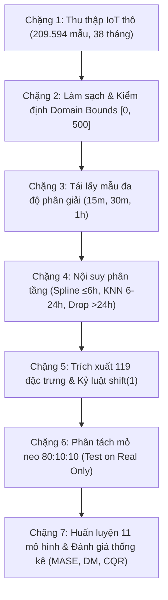

# 🏗️ Quy trình Nghiên cứu & Kỹ nghệ Dữ liệu 7 Bước (7-Step Workflow)

Quy trình nghiên cứu của đề án được chuẩn hóa thành dòng chảy 7 bước khép kín (minh họa tại **Hình 1.1** của báo cáo đề án), bảo đảm tính tái lập, tính liêm chính khoa học và hiệu năng vận hành trong thực tế.

---

## Chi tiết 7 Chặng Kỹ Thuật

### Chặng 1: Thu thập Dữ liệu IoT Thô (Raw IoT Ingestion)
- **Quy mô:** 209.594 bản ghi đo thực tế từ trạm quan trắc IoT ngoài trời tại TP. Sa Đéc, tỉnh Đồng Tháp.
- **Thời gian:** 16/03/2022 đến 11/05/2025 (kéo dài 38 tháng, ~3.1 năm, 1.152 ngày).
- **Tần suất thu thập:** Trung bình 2 phút/lần (median delta 121.0 giây).
- **Tham số đo đạc:** Nồng độ hạt mịn $PM_{2.5}$ ($\mu g/m^3$), Nhiệt độ không khí ($^\circ C$), Độ ẩm tương đối ($\%$), Áp suất khí quyển ($hPa$), Tốc độ gió ($m/s$).

### Chặng 2: Làm sạch & Kiểm định Ngưỡng Vật Lý (Sanitization & Domain Bounds)
- Loại bỏ các bản ghi trùng lặp thời gian hoặc thiếu hụt định danh cảm biến.
- Áp dụng **Domain Bounds** vật lý theo khuyến cáo WHO AQI: $[0, 500]\,\mu g/m^3$.
- Tránh xa bẫy xóa ngoại lai bằng IQR để bảo tồn các đỉnh ô nhiễm thực tế (xem chi tiết tại [[03_Outlier_Trap_and_Domain_Bounds]]).
- Thuật toán Seasonal Hybrid ESD (S-ESD) được sử dụng để phát hiện các đoạn cảm biến bị treo tín hiệu (flatline) hoặc lỗi phần cứng.

### Chặng 3: Tái lấy mẫu Đa Độ Phân Giải (Multi-Resolution Resampling)
- Dữ liệu thô 2 phút được tái lấy mẫu (resample) về 3 lưới thời gian đồng nhất:
  - **15 phút (15m):** Bắt trọn các vi xung phát thải tức thời.
  - **30 phút (30m):** Điểm ngọt Pareto (Pareto Sweet Spot) cân bằng tín hiệu và nhiễu (xem [[04_Multi_Resolution_Framing]]).
  - **1 giờ (1h):** Độ phân giải chuẩn đối chuẩn với các trạm quan trắc vĩ mô quốc gia.
- Quy tắc hợp lệ WMO: Chỉ tính giá trị đại diện khi khoảng thời gian có ít nhất 75% số điểm đo hợp lệ.

### Chặng 4: Phục hồi Dữ liệu Phân Tầng (Tiered Imputation)
- Dữ liệu quan trắc thực tế chịu tỷ lệ khuyết thiếu tới 74% do cúp điện, bảo trì và sự cố truyền thông.
- Phân tầng xử lý:
  - Khuyết ngắn ($\le 6$ giờ): Nội suy hàm ghép bậc ba PCHIP/Akima Spline bảo toàn tính đơn điệu.
  - Khuyết trung bình ($6 - 24$ giờ): Dùng KNN Imputation ($k=5$) chỉ lấy donor trong quá khứ.
  - Khuyết dài ($> 24$ giờ): **Dũng cảm loại bỏ 19.810 giờ** khuyết dài để chống sinh ảo giác dữ liệu (xem [[02_Tiered_Imputation_and_Data_Sparsity]]).
- Kích thước tập dữ liệu sạch thu được: 18.355 mẫu ở 15m, 8.625 mẫu ở 30m, và 6.689 mẫu ở 1h.

### Chặng 5: Kỹ Nghệ Đặc Trưng Chống Rò Rỉ (Anti-Leakage Feature Store)
- Xây dựng kho 119 đặc trưng đa chiều thuộc 6 nhóm (xem [[01_Feature_Store_119_Features]]).
- **Kỷ luật bất biến `shift(1)`:** 100% các biến trễ (lag), biến cửa sổ trượt (rolling statistics), sai phân (diff) đều phải trễ ít nhất 1 bước thời gian để triệt tiêu lookahead bias (xem [[01_Anti_Leakage_Shift1_Discipline]]).

### Chặng 6: Phân Tách Tập Thời Gian Mỏ Neo (Anchor Temporal Split)
- Tuyệt đối không dùng K-Fold ngẫu nhiên.
- Chia theo tỷ lệ thời gian **80:10:10**:
  - **Train (80%):** 16/03/2022 đến 30/09/2024.
  - **Validation (10%):** 01/10/2024 đến 31/12/2024 (tinh chỉnh Optuna TPE 50 trials, xem [[04_Hyperparameter_Tuning_Optuna]]).
  - **Anchor Test (10%):** 01/01/2025 đến 11/05/2025 (kích thước mẫu: 669h ở 1h, 863 mẫu ở 30m, 1.836 mẫu ở 15m).
- Áp dụng nguyên tắc **Test on Real Only:** chỉ chấm điểm trên các mẫu đo thật `is_imputed == 0` (xem [[02_Temporal_Split_and_Test_on_Real_Only]]).

### Chặng 7: Huấn Luyện, Đánh Giá & Giải Thích Mô Hình
- Huấn luyện đối chuẩn 11 kiến trúc mô hình (xem [[01_Benchmark_Models_Overview]]).
- Sử dụng **MASE** làm tiêu chuẩn vàng thay thế RMSE/MAE (xem [[01_Metrics_Standard_MASE_over_RMSE]]).
- Kiểm định ý nghĩa thống kê bằng Diebold-Mariano với hiệu chỉnh Harvey-HLN (xem [[02_Diebold_Mariano_Hypothesis_Testing]]).
- Định lượng độ bất định bằng Conformal Quantile Regression kết hợp Adaptive Conformal Inference (ACI) 90% (xem [[03_Uncertainty_Quantification_CQR_ACI]]).
- Khám phá tri thức miền bằng Tree SHAP và phát hiện điểm chuyển pha khí quyển 14–17 $\mu g/m^3$ (xem [[01_Tree_SHAP_vs_Permutation_Importance]] và [[02_Threshold_Tipping_Point_14_17]]).

---
*Liên kết liên quan: [[00_Index_MOC]] | [[02_Tiered_Imputation_and_Data_Sparsity]] | [[01_Anti_Leakage_Shift1_Discipline]] | [[01_Master_Defense_QnA_Hoi_Dong]]*\n