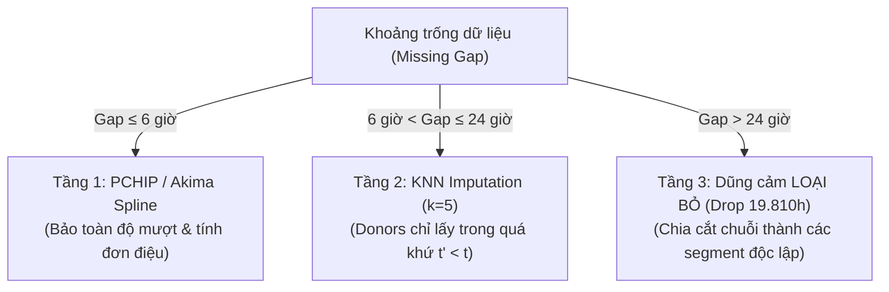

# 🧩 Chiến Lược Phục Hồi Dữ Liệu Phân Tầng & Xử Lý Độ Thưa Dữ Liệu IoT

## 1. Thực Trạng Độ Thưa Dữ Liệu Quan Trắc IoT Cấp Huyện
Quan trắc môi trường bằng cảm biến IoT chi phí thấp tại các đô thị cấp huyện như TP. Sa Đéc (Đồng Tháp) đối mặt với thách thức kỹ thuật lớn:
- Tổng thời gian khảo sát: **38 tháng (1.152 ngày)** từ 03/2022 đến 05/2025.
- Tỷ lệ thời gian khuyết thiếu tích lũy lên tới **74%**, xuất phát từ:
  - Cắt điện luân phiên hoặc sự cố lưới điện nông thôn.
  - Bảo trì cảm biến định kỳ hoặc hư hỏng buồng đo quang học do độ ẩm cao miền Tây Nam Bộ.
  - Lỗi đường truyền mạng viễn thông (mất sóng di động, nghẽn cổng IoT Gateway).

Nếu áp dụng các phương pháp nội suy truyền thống (như Mean, Forward-Fill, Linear Interpolation) trên toàn bộ chuỗi khuyết, mô hình sẽ bị "ngộ độc dữ liệu giả" (Data Hallucination) và phá hủy cấu trúc phương sai thực tế.

---

## 2. Chiến Lược 3 Tầng Nghiêm Ngặt (Three-Tier Strategy)

### Tầng 1: Khuyết ngắn ($\le 6$ giờ) — PCHIP / Akima Spline
- **Đặc điểm:** Chiếm phần lớn các sự cố rớt mạng viễn thông tạm thời hoặc reset cảm biến.
- **Phương pháp:** Sử dụng Piecewise Cubic Hermite Interpolating Polynomial (PCHIP) hoặc Akima Spline.
- **Ưu điểm:** Khắc phục triệt để hiện tượng vọt lố (overshooting) của Cubic Spline thông thường; bảo toàn tính đơn điệu cục bộ giữa các điểm đo thực tế.

### Tầng 2: Khuyết trung bình ($6 < \text{gap} \le 24$ giờ) — KNN Imputation Kỷ Luật
- **Đặc điểm:** Tương ứng với một chu kỳ ngày đêm (diurnal cycle).
- **Phương pháp:** $k$-Nearest Neighbors ($k=5$) dựa trên các biến ngoại sinh (Nhiệt độ, Độ ẩm, Giờ trong ngày).
- **Kỷ luật chống rò rỉ:** Các mẫu láng giềng (donors) **bắt buộc chỉ được tìm kiếm trong quá khứ** ($t' < t$). Tuyệt đối không lấy dữ liệu tương lai để nội suy cho quá khứ.

### Tầng 3: Khuyết dài ($> 24$ giờ) — Quyết Định Dũng Cảm Drop 19.810 Giờ
- **Bản chất khoa học:** Khi khoảng trống vượt quá 24 giờ (có những đợt trạm dừng hoạt động 2-3 tuần), dữ liệu rơi vào cơ chế **MNAR (Missing Not At Random)**.
- **Quyết định:** Loại bỏ hoàn toàn 19.810 giờ khuyết dài. Không cố gắng lấp đầy chuỗi một cách cưỡng bức.
- **Cách tiếp cận:** Cắt chuỗi thời gian thành các **đoạn liên tục độc lập (continuous valid segments)**. Mô hình chỉ học trên các đoạn liên tục có ý nghĩa vật lý.
- **Kết quả thu được:**
  - Độ phân giải 15m: **18.355 mẫu sạch**.
  - Độ phân giải 30m: **8.625 mẫu sạch**.
  - Độ phân giải 1h: **6.689 mẫu sạch** (sau khi đã loại bỏ 19.810 giờ khuyết).

---

## 3. Luận Giải Phản Biện Trước Hội Đồng (Defense Argument)
> *"Tại sao không dùng các mô hình tạo sinh tiên tiến như MICE, MissForest hay Time-Series GAN để lấp đầy 19.810 giờ khuyết?"*

**Kịch bản trả lời:**
1. **Bảo tồn tính trung thực khoa học:** 19.810 giờ tương đương hơn 2.2 năm tích lũy. Việc dùng GAN hay MICE để vẽ ra 19.810 giờ dữ liệu sẽ biến nghiên cứu từ "Dự báo dữ liệu môi trường thực tế Sa Đéc" thành "Dự báo dữ liệu nhân tạo do mô hình khác sinh ra".
2. **Ngăn chặn phá vỡ phân phối vi khí hậu:** Ô nhiễm không khí phụ thuộc vào các xung thời tiết thực tế (gió chướng, mưa dông, đốt đồng). Mô hình nội suy không thể tự tạo ra các xung thời tiết này một cách trung thực.
3. **Thực tiễn kỹ thuật:** Đề án thà chấp nhận số lượng mẫu ít hơn nhưng 100% sạch và thật, còn hơn sở hữu bộ dữ liệu khổng lồ nhưng chứa đầy ảo giác.

---
*Liên kết liên quan: [[01_Pipeline_7_Steps]] | [[01_Anti_Leakage_Shift1_Discipline]] | [[02_Temporal_Split_and_Test_on_Real_Only]] | [[01_Master_Defense_QnA_Hoi_Dong]]*\n