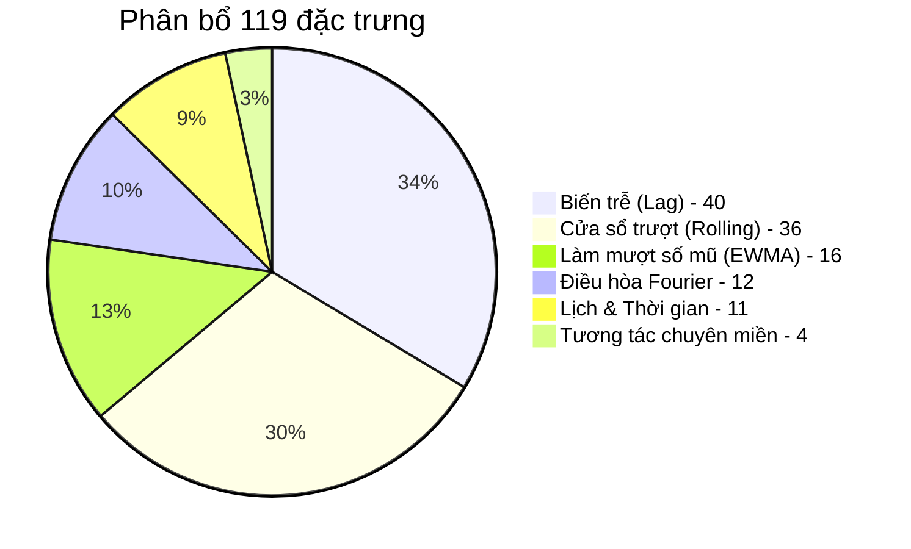

# 🗄️ Kho Đặc Trưng 119 Chiều (Feature Store) & Ma Trận Tương Tác Vi Khí Hậu

## 1. Kiến Trúc 6 Nhóm Đặc Trưng (119 Chiều)
Kho đặc trưng của đề án được thiết kế chuyên biệt cho bài toán vi khí hậu Đồng bằng sông Cửu Long, bao gồm **119 đặc trưng** chia thành 6 nhóm logic:

---

## 2. Chi Tiết Từng Nhóm Đặc Trưng

### Nhóm 1: Biến Trễ (Lag Features — 40 đặc trưng)
- Độ trễ tức thời: $t-1, t-2, t-3, t-4, t-5, t-6$.
- Độ trễ trung hạn: $t-12, t-24$ (chu kỳ 1 ngày trước), $t-48$ (2 ngày trước).
- Độ trễ dài hạn: $t-72, t-96, t-120, t-144, t-168$ (đúng 1 tuần trước).
- Áp dụng đồng thời cho $PM_{2.5}$ và 4 biến khí tượng (Nhiệt độ, Độ ẩm, Tốc độ gió, Áp suất khí quyển).

### Nhóm 2: Thống Kê Cửa Sổ Trượt (Rolling Statistics — 36 đặc trưng)
- Các cửa sổ trượt: 3h, 6h, 12h, 24h, 48h, 72h, 168h.
- Các hàm thống kê: Mean (trung bình), Std (độ lệch chuẩn), Min, Max, Skew (độ lệch).
- *Toàn bộ được áp dụng kỷ luật `shift(1)` trước khi trượt*.

### Nhóm 3: Trung Bình Trọng Số Số Mũ (EWMA Features — 16 đặc trưng)
- Các hệ số làm mượt ($\alpha$ hoặc span tương đương 3h, 6h, 12h, 24h, 72h).
- Giúp mô hình bắt kịp quán tính phân rã ô nhiễm mà không bị gián đoạn đột ngột như cửa sổ chữ nhật (Boxcar rolling).

### Nhóm 4: Điều Hòa Fourier (Fourier Harmonics — 12 đặc trưng)
- Trích xuất các hàm điều hòa lượng giác:
  $$\sin\l\left(\f\frac{2\pi k t}{T}
\right), \quad \cos\l\left(\f\frac{2\pi k t}{T}
\right)$$
- Chu kỳ nhật triều ($T = 24$ giờ, $k=1, 2, 3$).
- Chu kỳ tuần hoàn tuần ($T = 168$ giờ, $k=1, 2$).
- Giúp mô hình tuyến tính và cây nắm bắt trơn tru tính tuần hoàn liên tục mà không bị nhảy bước ở thời điểm 23h59 $	o$ 00h00.

### Nhóm 5: Lịch và Thời Gian (Calendar & Cyclical — 11 đặc trưng)
- `hour_sin`, `hour_cos` (mã hóa vòng tròn 24 giờ).
- `dayofweek_sin`, `dayofweek_cos` (mã hóa vòng tròn 7 ngày).
- `month_sin`, `month_cos` (chu kỳ mùa mưa - mùa khô miền Tây).
- Cờ nhị phân: `is_weekend` (cuối tuần), `is_rush_hour` (giờ cao điểm 6-8h và 17-19h).

### Nhóm 6: Tương Tác Chuyên Miền (Domain Interactions — 4 đặc trưng)
1. **Chỉ số thông gió khí quyển (Ventilation Index):**
   $$VI = \text{Tốc độ gió} 	imes \text{Chiều cao lớp biên ước tính}$$
2. **Tỷ số nhiệt ẩm vi khí hậu:** $\f\frac{\text{Nhiệt độ}}{\text{Độ ẩm}}$ (phản ánh khả năng bốc hơi và ngưng tụ hạt keo aerosol).
3. **Tốc độ biến thiên nồng độ (Rate of Change):** Sai phân bậc 1 trễ của PM2.5.
4. **Tỷ lệ đóng góp ô nhiễm nền:** Tỷ số giữa trễ tức thời $t-1$ và nồng độ nền 24h.

---

## 3. Quản Lý & Lưu Trữ Feature Store
Kho đặc trưng được tiền xử lý và lưu trữ cố định dưới các file Marts:
- `dataset/processed/marts_features.csv` (Độ phân giải 1h, 12.9 MB).
- `dataset/processed/marts_features_30m.csv` (Độ phân giải 30m, 14.2 MB).
- `dataset/processed/marts_features_15m.csv` (Độ phân giải 15m, 27.4 MB).
Giúp việc suy luận và kiểm định diễn ra tức thì trong thời gian thực mà không tiêu tốn CPU/RAM để tính toán lại.

---
*Liên kết liên quan: [[01_Pipeline_7_Steps]] | [[01_Anti_Leakage_Shift1_Discipline]] | [[02_Stationarity_ADF_KPSS]] | [[01_Tree_SHAP_vs_Permutation_Importance]]*\n