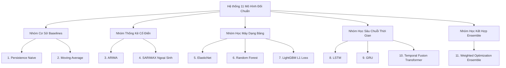

# 🤖 Tổng Quan 11 Kiến Trúc Mô Hình Đối Chuẩn (Benchmark Architectures)

Đề án triển khai và đối chuẩn toàn diện **11 kiến trúc mô hình** đại diện cho 4 trường phái phương pháp luận dự báo chuỗi thời gian:

---

## Bảng Đặc Tả Kỹ Thuật 11 Mô Hình

| STT | Tên Mô Hình | Trường Phái | Không Gian Tham Số & Cấu Hình | Điểm Mạnh / Ghi Chú Kỹ Thuật |
|---|---|---|---|---|
| **1** | **Persistence** | Naive Baseline | $\hat{y}_{t+h} = y_t$ | Đối thủ cực mạnh ở chuỗi giờ $h=1$ do $r=0.86$ |
| **2** | **Moving Average** | Baseline | Window $k \in \{3, 6, 12, 24\}$ | Đường cơ sở trơn để so sánh độ trễ |
| **3** | **ARIMA** | Thống kê tuyến tính | $(p, d, q) = (2, 0, 1)$ | Hạn chế với chuỗi phi tuyến tính đuôi nặng |
| **4** | **SARIMAX** | Thống kê có ngoại sinh | Thêm Nhiệt độ, Độ ẩm, Gió | Bắt được một phần chu kỳ ngày đêm |
| **5** | **ElasticNet** | Hồi quy tuyến tính chính quy hóa | $\alpha \in [1e-4, 10]$, $l_1 \in [0, 1]$ | Đường cơ sở tuyến tính với 119 đặc trưng |
| **6** | **Random Forest** | Cây quyết định Bagging | 200 trees, `max_depth=12` | Nắm bắt tương tác phi tuyến, chống overfit |
| **7** | **LightGBM** | Cây quyết định Boosting | `objective="regression_l1"`, $n_{est}=300$, `num_leaves=31` | Cực nhanh; ép $n_{jobs}=1$ chống crash OpenMP |
| **8** | **LSTM** | Mạng nơ-ron hồi quy | 2 layers, `hidden_dim=64`, dropout=0.2 | Ghi nhớ phụ thuộc dài hạn qua cổng nhớ tế bào |
| **9** | **GRU** | Mạng nơ-ron cổng tối giản | 2 layers, `hidden_dim=64`, batch=64 | Cấu trúc tinh gọn, phá vỡ bẫy 1h ở mức 15m |
| **10** | **TFT** | Transformer chuỗi thời gian | Gated Residual Networks, Multi-Head Attn | Tự động chọn biến quan trọng, chi phí tính toán cao |
| **11** | **Weighted Ensemble** | Học kết hợp tối ưu trọng số | $\min_w \|Y - \sum w_i \hat{Y}_i\|_1$ s.t. $\sum w_i = 1, w_i \ge 0$ | **Mô hình Quán quân toàn diện đề án** |

---

## Tiêu Chuẩn Thực Thi An Toàn Trong Hệ Thống
1. **Khắc phục lỗi xung đột OpenMP (macOS / Render):** Đề án ép `OMP_NUM_THREADS=1`, `OPENBLAS_NUM_THREADS=1` tại tất cả các điểm khởi tạo mô hình LightGBM và PyTorch, triệt tiêu hoàn toàn mã lỗi crash SIGSEGV 139.
2. **Objective MAE:** LightGBM được cấu hình tường minh với `objective="regression_l1"`, đồng bộ hóa hoàn toàn hàm mục tiêu tối ưu với tiêu chuẩn đánh giá MASE của đề án.

---
*Liên kết liên quan: [[01_Pipeline_7_Steps]] | [[02_Autocorrelation_Trap_and_GRU_15m]] | [[03_Sweet_Spot_30m_Ensemble]] | [[04_Hyperparameter_Tuning_Optuna]]*\n