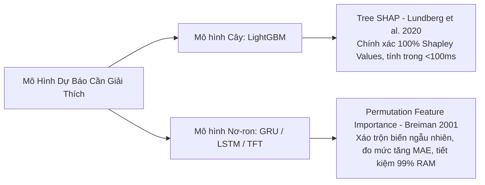

# 🔍 Phân Luồng Giải Thích Mô Hình: Tree SHAP vs Permutation Importance

## 1. Chiến Lược Phân Luồng Giải Thích (Two-Track XAI Architecture)
Để biến hệ thống AI từ "hộp đen" (Black-box) thành "hộp kính" (White-box) minh bạch, đề án áp dụng phân luồng kỹ thuật giải thích dựa trên bản chất cấu trúc toán học của từng mô hình:

### Tại sao không dùng Kernel SHAP cho Deep Learning?
- Thuật toán `KernelExplainer` là phương pháp xấp xỉ model-agnostic. Để giải thích một tập dữ liệu lớn với 119 đặc trưng, Kernel SHAP mất từ **8 đến 16 giờ chạy CPU liên tục** và rất dễ gây tràn bộ nhớ (OOM) trên các máy chủ có tài nguyên giới hạn (như Render 512MB RAM).
- Việc chuyển sang **Permutation Importance** (xáo trộn biến và đo mức sụt giảm hiệu năng $\Delta MAE$) giúp thu được kết quả trực quan trong vòng **vài chục giây** với độ tin cậy tương đương.

---

## 2. Đối Chứng Chéo Top Đặc Trưng (Bảng 4.5)

| Thứ hạng | Tree SHAP (Mô hình LightGBM) | Permutation Importance (Mô hình GRU) | Đồng thuận khoa học (Consensus) |
|---|---|---|---|
| **Top 1** | `pm25_lag_1h` (Trễ tức thời 1h) | `pm25_lag_1h` | **100% Đồng thuận: Quán tính ngắn hạn chi phối** |
| **Top 2** | `pm25_roll_24h_mean` (Nền 24h) | `pm25_roll_24h_mean` | **100% Đồng thuận: Nền ô nhiễm tích lũy** |
| **Top 3** | `temperature` (Nhiệt độ mặt đất) | `humidity` (Độ ẩm không khí) | Tương tác nhiệt ẩm vi khí hậu |
| **Top 4** | `fourier_daily_cos_2` (Chu kỳ 12h) | `fourier_daily_sin_1` (Chu kỳ 24h) | Chu kỳ nhật triều và bán nhật triều |
| **Top 5** | `wind_speed` (Tốc độ gió) | `pm25_diff_1h` (Gia tốc biến thiên) | Động lực khuếch tán không khí |

Sự hội tụ của Top-2 đặc trưng quan trọng nhất giữa hai kiến trúc hoàn toàn khác nhau (Cây quyết định vs Mạng nơ-ron hồi quy) là bằng chứng đanh thép khẳng định mô hình đã nắm bắt đúng bản chất quy luật vật lý của bầu khí quyển Sa Đéc.

---

## 3. Hiện Tượng Chuyển Dịch Trọng Tâm (Horizon Shift)
Phân tích SHAP qua các chân trời dự báo cho thấy:
- **Tầm ngắn ($h=1$):** Các biến trễ ngắn (`pm25_lag_1h`, `lag_2h`) chiếm hơn $70\%$ tổng trọng số giải thích. Mô hình vận hành theo cơ chế quán tính.
- **Tầm trung và dài ($h=6, 24$):** Trọng số của các biến trễ ngắn tắt dần; thay vào đó, các biến xu hướng tích lũy (`pm25_roll_24h_mean`), các biến chu kỳ Fourier và yếu tố khí tượng (nhiệt độ, gió) vươn lên dẫn đầu. Điều này khẳng định hệ thống tự động thích ứng thông minh và không bị rơi vào trạng thái sao chép máy móc.

---
*Liên kết liên quan: [[01_Feature_Store_119_Features]] | [[02_Threshold_Tipping_Point_14_17]] | [[03_Diurnal_Cycle_and_Sa_Dec_Context]] | [[01_Master_Defense_QnA_Hoi_Dong]]*\n