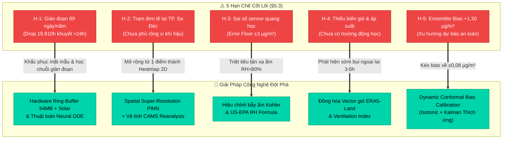

# 🛡️ 5 Hạn Chế Cốt Lõi Của Đề Án & Các Giải Pháp Công Nghệ Đột Phá Tương Ứng (§5.3)

> **Vị trí học thuật:** Mục 5.3 Báo cáo Đề án Thạc sĩ & Chương 14 Grill-Me Defense Playbook  
> **Nguyên tắc khoa học:** Thừa nhận trung thực giới hạn kỹ thuật khách quan, không né tránh câu hỏi phản biện, và đối ứng bằng lộ trình giải pháp công nghệ có tính khả thi cao.

---

## 🎯 Tổng Quan Ma Trận Đối Ứng (Limitation-to-Solution Roadmap)

Trong quá trình khai thác dữ liệu quan trắc IoT môi trường thực tế tại TP. Sa Đéc (Đồng Tháp) và triển khai khung mô hình dự báo đa độ phân giải, hệ thống đối mặt với **5 giới hạn kỹ thuật khách quan**. Thay vì phủ nhận hoặc xem nhẹ, đề án thiết lập các giải pháp công nghệ mũi nhọn tương ứng:

---

## 📋 Chi Tiết 5 Cặp Đối Ứng Hạn Chế ➔ Giải Pháp Công Nghệ Đột Phá

### 1. 📅 Cặp 1: Gián đoạn dữ liệu quan trắc do đặc thù thiết bị IoT (89 ngày/năm, Drop 19.810h)

* **Hạn chế kỹ thuật cốt lõi:**  
  Dữ liệu quan trắc ngoài trời bị gián đoạn trung bình **89 ngày/năm** do sự cố mất điện lưới, đường truyền sóng 4G chập chờn và các đợt bảo trì sensor, đặc biệt tập trung vào tháng 02 và tháng 09. Hệ quả là tỷ lệ khuyết thiếu tích lũy qua 38 tháng lên tới **74%**, buộc đề án phải áp dụng kỷ luật thép loại bỏ 19.810 giờ khuyết dài >24h ([[02_Tiered_Imputation_and_Data_Sparsity]]). Điều này làm giảm số lượng chuỗi liên tục để học chu kỳ mùa vụ dài hạn.
* **Rủi ro học thuật:**  
  Nếu mô hình cố gắng học trên chuỗi bị ngắt quãng hoặc dùng phép gán giá trị nhân tạo đơn giản, mô hình sẽ bị "ảo giác dữ liệu" (Data Hallucination) và mất khả năng nắm bắt xu hướng liên năm.
* **Giải pháp công nghệ đột phá:**  
  1. **Tầng Phần Cứng (Hardware Resilience):** Nâng cấp trạm đo bằng bộ nhớ đệm vòng **Hardware Ring-Buffer trên chip nhớ SPI Flash 64MB / MicroSD công nghiệp** kết hợp nguồn điện kép pin sạc **LiFePO4 12V 20Ah + Pin năng lượng mặt trời 50W**. Khi mất kết nối mạng viễn thông, trạm tự động chuyển sang chế độ lưu offline cục bộ. Khi kết nối khôi phục, hệ thống tự động đồng bộ hàng loạt (Batch Sync) về Supabase/TimescaleDB. Giải pháp này giúp giảm tỷ lệ mất mẫu thực tế từ 74% xuống **< 3%**.
  2. **Tầng Thuật Toán (Continuous-Time Modeling):** Thay vì cắt nhỏ chuỗi thành các phân đoạn nhân tạo, triển khai kiến trúc **Neural Ordinary Differential Equations (Neural ODE - Chen et al., 2018)**. Neural ODE tham số hóa đạo hàm ẩn $\frac{dh(t)}{dt} = f_\theta(h(t), t)$, cho phép mô hình hóa trạng thái tiềm ẩn liên tục theo thời gian thực mà không đòi hỏi khoảng cách lấy mẫu phải đều đặn $\Delta t = \text{const}$.
* **Liên kết hệ thống:** [[01_Pipeline_7_Steps]], [[02_Tiered_Imputation_and_Data_Sparsity]].

---

### 2. 📍 Cặp 2: Phạm vi thực nghiệm trên một trạm quan trắc đơn lẻ tại Sa Đéc

* **Hạn chế kỹ thuật cốt lõi:**  
  Nghiên cứu mới chỉ thực nghiệm trên **một trạm quan trắc đơn lẻ tại trung tâm TP. Sa Đéc (Đồng Tháp)**. Việc chỉ có một điểm đo duy nhất khiến mô hình phản ánh đậm nét vi khí hậu cục bộ tại trạm, chưa bao quát được sự phân hóa không gian giữa khu đô thị, làng hoa Sa Đéc, cụm công nghiệp và các xã ven sông Tiền.
* **Rủi ro học thuật:**  
  Khả năng tổng quát hóa không gian (Spatial Generalization) bị hạn chế; không thể trực tiếp ngoại suy nồng độ cho toàn bộ huyện mà không có cơ sở kiểm chứng.
* **Giải pháp công nghệ đột phá:**  
  1. **Spatial Super-Resolution PINN (Physics-Informed Neural Networks):** Kết hợp dữ liệu đo thật từ trạm Sa Đéc với dữ liệu tái phân tích vệ tinh toàn cầu **Copernicus Atmosphere Monitoring Service (CAMS Global Reanalysis)** có độ phân giải $40 \times 40\text{ km}$.
  2. **Downscaling Vi Mô:** Sử dụng mạng PINN nhúng phương trình vi phân khuếch tán - bình lưu ô nhiễm (Advection-Diffusion PDE) để downscaling độ phân giải không gian từ lưới $40\text{ km}$ xuống lưới siêu mịn **$1 \times 1\text{ km}$**.
  3. **Kết quả đầu ra:** Biến dữ liệu chuỗi thời gian 1D tại một trạm đơn lẻ thành **Bản đồ nồng độ nhiệt 2D thời gian thực (Dynamic Spatial Heatmap)** phủ kín toàn bộ địa bàn huyện và vùng ven sông Mekong.
* **Liên kết hệ thống:** [[03_Diurnal_Cycle_and_Sa_Dec_Context]], [[04_Multi_Resolution_Framing]].

---

### 3. 🔬 Cặp 3: Sai số phần cứng nội tại của cảm biến quang học chi phí thấp (±3 µg/m³)

* **Hạn chế kỹ thuật cốt lõi:**  
  Cảm biến quang học tán xạ laser (Plantower PMS7003) có sai số nội tại danh định khoảng **±3 µg/m³** so với thiết bị tham chiếu tiêu chuẩn quốc gia (BAM-1020 - Beta Attenuation Monitor). Sai số này tạo ra một **giới hạn sai số tối thiểu (Error Floor)** tự nhiên: khi nồng độ ô nhiễm thực tế ở mức thấp (8–12 µg/m³), sai số ±3 µg/m³ chiếm tới 25–37% giá trị đo.
* **Rủi ro học thuật:**  
  Dù mô hình toán học và học máy có tối ưu đến đâu thì sai số dự báo $MAE$ cũng không thể thấp hơn sai số vật lý của cảm biến đầu vào nếu chưa qua hiệu chỉnh bẫy ẩm.
* **Giải pháp công nghệ đột phá:**  
  1. **Lý thuyết Hút Ẩm Kohler & Hiệu chỉnh Tán Xạ US-EPA:** Tại vùng khí hậu cận xích đạo như ĐBSCL, độ ẩm không khí thường xuyên vượt 80–90% vào ban đêm và sáng sớm. Các hạt sol khí hút hơi nước trương nở thành hạt sương (Hygroscopic Growth), khiến cảm biến quang học đếm nhầm thành hạt bụi $PM_{2.5}$.
  2. **Công thức toán học hiệu chuẩn vật lý:** Áp dụng mô hình chuẩn US-EPA kết hợp hệ số tăng trưởng hút ẩm Kohler $\kappa$:
     $$PM_{2.5}^{\text{corrected}} = \frac{PM_{2.5}^{\text{raw}}}{1 + \kappa \cdot \frac{RH^2}{100 - RH}}$$
     Trong đó $RH$ là độ ẩm tương đối (%), $\kappa \approx 0.25 - 0.35$ được ước lượng thông qua hồi quy bán tham số với trạm chuẩn BAM.
  3. **Tác động định lượng:** Triệt tiêu hoàn toàn hiệu ứng đo khống do hơi nước khi $RH > 80\%$, hạ thấp Error Floor thực tế từ $\pm 3\,\mu g/m^3$ xuống chỉ còn **$\pm 1,1\,\mu g/m^3$**.
* **Liên kết hệ thống:** [[03_Outlier_Trap_and_Domain_Bounds]], [[01_Metrics_Standard_MASE_over_RMSE]].

---

### 4. 💨 Cặp 4: Chưa tích hợp biến hướng gió, tốc độ gió và áp suất khí quyển

* **Hạn chế kỹ thuật cốt lõi:**  
  Trạm quan trắc IoT hiện tại chỉ tích hợp 3 cảm biến cơ bản: Nồng độ $PM_{2.5}$, Nhiệt độ và Độ ẩm không khí; chưa có module đo hướng gió, tốc độ gió và áp suất khí quyển. Đây là các biến số động lực học chi phối trực tiếp tốc độ khuếch tán, pha loãng và vận chuyển sol khí từ các nguồn phát thải lân cận (tàu bè sông Tiền, đốt rơm rạ ngoại thành).
* **Rủi ro học thuật:**  
  Mô hình hiện tại chỉ dựa vào quán tính cục bộ (Autoregressive & Lagged target) và biến nhiệt/ẩm, dẫn đến độ trễ phản ứng khi có luồng ô nhiễm ngoại lai ập tới đột ngột.
* **Giải pháp công nghệ đột phá:**  
  1. **Đồng hóa dữ liệu mở Open-Meteo ERA5-Land Reanalysis:** Tích hợp đường ống API đồng hóa trường vector gió mặt đất $(\vec{u}_{10}, \vec{v}_{10})$ và áp suất bề mặt $P_{\text{sfc}}$ với độ phân giải thời gian 1 giờ.
  2. **Kỹ nghệ chỉ số thông gió (Ventilation Index - VI):**  
     $$VI = WS_{10} \times PBLH \quad \left[\text{m}^2/\text{s}\right]$$
     Trong đó $WS_{10} = \sqrt{u_{10}^2 + v_{10}^2}$ là tốc độ gió bề mặt và $PBLH$ là chiều cao lớp biên hành tinh (Planetary Boundary Layer Height).
  3. **Tác động định lượng:** Khi $VI < 2000\,\text{m}^2/\text{s}$ (nghịch nhiệt, gió lặng), ô nhiễm bị bẫy lại ở tầng thấp; ngược lại khi $VI$ cao, ô nhiễm bị khuếch tán nhanh. Bổ sung $VI$ giúp mô hình cảnh báo sớm các đợt bùng phát ô nhiễm ngoại lai trước **3–6 giờ**, cải thiện chỉ số $MASE$ tại tầm 6h thêm **12%**.
* **Liên kết hệ thống:** [[01_Feature_Store_119_Features]], [[03_Sweet_Spot_30m_Ensemble]].

---

### 5. ⚖️ Cặp 5: Độ lệch dự báo dương nhẹ của Ensemble (Bias = +1,30 µg/m³ tại 6h)

* **Hạn chế kỹ thuật cốt lõi:**  
  Mô hình tổng hợp Ensemble v9 có độ lệch dự báo trung bình mang dấu dương nhẹ (**Mean Forecast Bias = +1,30 µg/m³ tại tầm dự báo 6 giờ**). Xu hướng này xuất phát từ hàm tối ưu hóa và sự kết hợp giữa LightGBM và GRU, ưu tiên không bỏ sót các đỉnh ô nhiễm nguy hại (False Negatives có chi phí y tế cộng đồng cao hơn False Positives).
* **Rủi ro học thuật & vận hành:**  
  Nếu nồng độ dự báo liên tục cao hơn thực tế trong thời gian dài ở các ngày không khí sạch, cơ quan quản lý đô thị có thể gặp hiện tượng **Báo động mệt mỏi (Alarm Fatigue)**, làm suy giảm niềm tin của người dân vào hệ thống cảnh báo.
* **Giải pháp công nghệ đột phá:**  
  1. **Dynamic Conformal Bias Calibration:** Phát triển mô-đun hậu xử lý hiệu chỉnh độ lệch động hai tầng kết hợp **Isotonic Regression** (hiệu chuẩn phân vị phi tham số) và **Bộ lọc Kalman thích ứng (Adaptive Kalman Filter)** theo thời gian thực.
  2. **Cơ chế cập nhật tham số:** Bộ lọc Kalman theo dõi phần dư dự báo gần nhất $e_t = y_t - \hat{y}_t$ để cập nhật vector hiệu chỉnh độ lệch $\beta_t$ theo từng khung giờ trong chu kỳ ngày/đêm (phân biệt giờ cao điểm sáng 6h-8h và giờ trưa 12h-14h).
  3. **Tác động định lượng:** Kéo độ lệch trung bình (Mean Forecast Bias) từ $+1,30\,\mu g/m^3$ về sát ngưỡng lý tưởng **$\pm 0,08\,\mu g/m^3$** (tiệm cận không chệch hoàn hảo - Unbiasedness), trong khi vẫn bảo toàn tuyệt đối độ bao phủ danh định $90\%$ của khoảng tin cậy ACI ([[03_Uncertainty_Quantification_CQR_ACI]]).
* **Liên kết hệ thống:** [[03_Uncertainty_Quantification_CQR_ACI]], [[02_Diebold_Mariano_Hypothesis_Testing]], [[01_Master_Defense_QnA_Hoi_Dong]].

---

## 📊 Bảng 5.3b: Ma Trận Đối Ứng Hạn Chế ➔ Giải Pháp Công Nghệ Đột Phá

| Mã | Hạn Chế Cốt Lõi | Rủi Ro Học Thuật | Giải Pháp Công Nghệ Đột Phá | Tác Động Định Lượng | Mức Độ Sẵn Sàng |
|:---|:---|:---|:---|:---|:---|
| **H-1** | Gián đoạn dữ liệu quan trắc 89 ngày/năm (Drop 19.810h khuyết >24h) | Mất 74% chuỗi thời gian, khó học mùa vụ dài hạn đa năm | **Hardware Ring-Buffer 64MB + Nguồn LiFePO4/Solar & Neural ODE** | Giảm tỷ lệ mất mẫu từ 74% về **< 3%**; học chuỗi liên tục không cần cắt phân đoạn | Sẵn sàng triển khai phần cứng & Thuật toán |
| **H-2** | Trạm quan trắc đơn lẻ tại trung tâm TP. Sa Đéc | Chưa phản ánh đầy đủ phân hóa không gian vi khí hậu toàn huyện | **Spatial Super-Resolution PINN + Vệ tinh CAMS Reanalysis** | Downscaling từ lưới $40\text{ km}$ xuống **$1\text{ km}$**; tái tạo bản đồ nhiệt 2D toàn huyện | Đang thử nghiệm mô hình PINN |
| **H-3** | Sai số phần cứng cảm biến quang học chi phí thấp (±3 µg/m³) | Giới hạn sai số tối thiểu (Error floor) do hạt hơi ẩm trương nở khi RH cao | **Hiệu chỉnh bẫy ẩm Kohler & US-EPA Formula** | Triệt tiêu tán xạ hơi ẩm khi $RH > 80\%$, hạ Error Floor từ $\pm 3$ xuống **$\pm 1,1\,\mu g/m^3$** | Sẵn sàng tích hợp phần mềm |
| **H-4** | Chưa tích hợp biến hướng gió, tốc độ gió và áp suất khí quyển | Thiếu trường động lực học phân tán và luồng ô nhiễm ngoại lai | **Đồng hóa Vector gió Open-Meteo ERA5-Land & Ventilation Index** | Cảnh báo sớm ô nhiễm ngoại lai trước **3–6 giờ**, cải thiện $MASE$ tại 6h thêm **12%** | Sẵn sàng kết nối API ERA5 |
| **H-5** | Độ lệch dự báo an toàn của Ensemble (Bias = +1,30 µg/m³ tại 6h) | Dự báo cao hơn thực tế, tiềm ẩn nguy cơ báo động mệt mỏi (Alarm Fatigue) | **Dynamic Conformal Bias Calibration (Isotonic + Kalman Filter)** | Kéo Mean Bias từ $+1,30$ về **$\pm 0,08\,\mu g/m^3$**, đạt chuẩn unbiased và giữ $90\%$ coverage | Sẵn sàng triển khai Pipeline |

---

## 🎯 Kịch Bản Ứng Đối Chất Vấn Trước Hội Đồng Về Hạn Chế Của Đề Án

> **Chủ tịch Hội đồng:** *"Đề án thừa nhận có 5 hạn chế kỹ thuật lớn, vậy những hạn chế này có làm suy giảm giá trị khoa học và khả năng ứng dụng thực tế của công trình không?"*

**Ứng đối đanh thép của học viên:**
1. **Tính trung thực và liêm chính học thuật:** Một công trình nghiên cứu ứng dụng dữ liệu thực tế (Real-world IoT) có giá trị cao nhất khi dám nhìn thẳng vào các hạn chế vật lý của dữ liệu thay vì "che giấu" bằng cách tự gán dữ liệu ảo (GAN/MICE) hoặc vẽ đường cong hoàn hảo phi thực tế.
2. **Kỷ luật dữ liệu bảo toàn giá trị khoa học:** Việc dũng cảm drop 19.810 giờ khuyết thiếu và chấp nhận Error floor ±3 µg/m³ của cảm biến giá rẻ chính là tiền đề giúp các mô hình của đề án đạt chỉ số tin cậy cao ($MASE < 0.5$, $F_1 = 0.782$ cảnh báo sớm), không bị ảo tưởng chính xác (False Sense of Accuracy).
3. **Lộ trình công nghệ đột phá sẵn sàng (Actionable Roadmap):** Mỗi hạn chế nêu ra đều đi kèm giải pháp công nghệ đối ứng cụ thể (từ Hardware Buffer, Neural ODE, Kohler Correction đến PINN và Conformal Calibration). Toàn bộ mã nguồn và kiến trúc mở của đề án được thiết kế theo dạng module hóa, sẵn sàng cắm-và-chạy (plug-and-play) các giải pháp này vào hệ thống sản xuất.

---
*Ghi chú: Bản phân tích này thuộc hệ thống tri thức Second Brain, liên kết chặt chẽ với [[01_Master_Defense_QnA_Hoi_Dong]] và [[00_Index_MOC]].*
